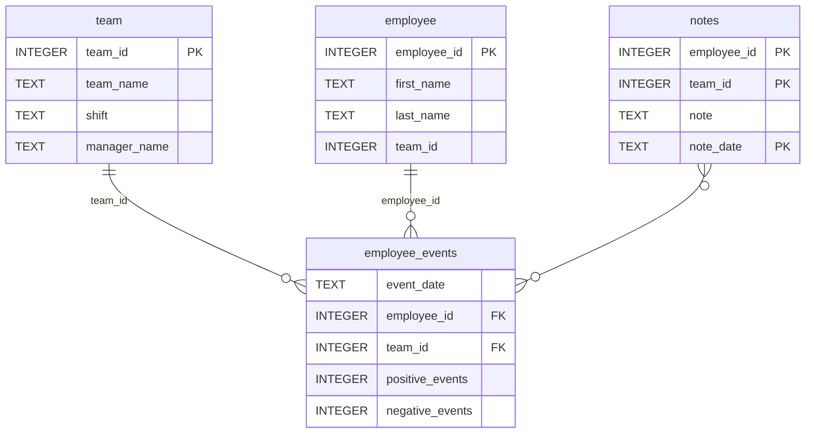
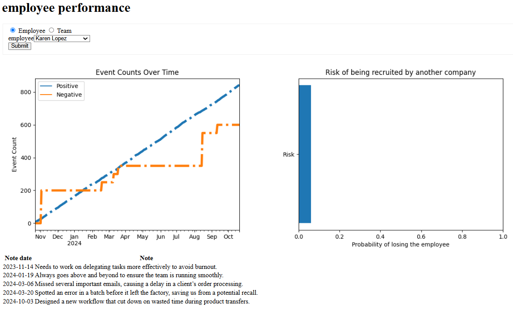
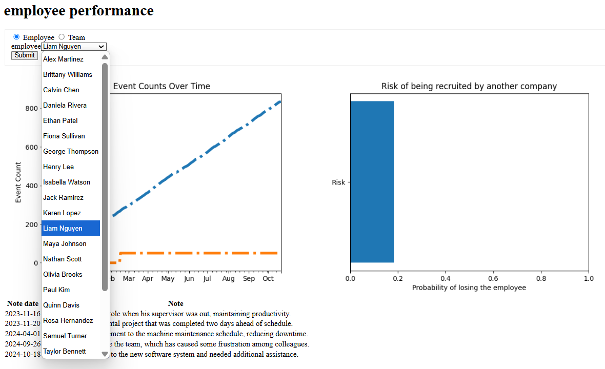
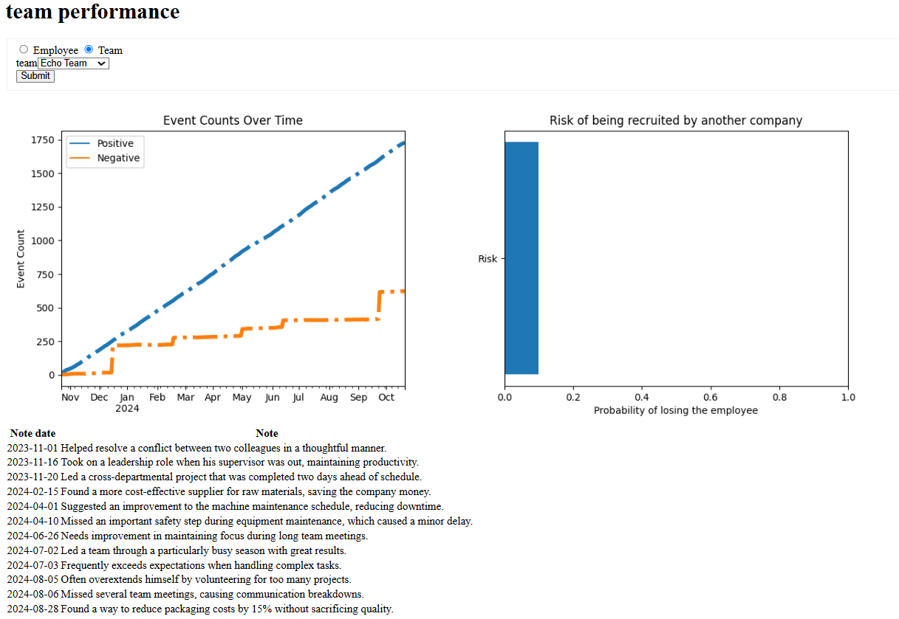
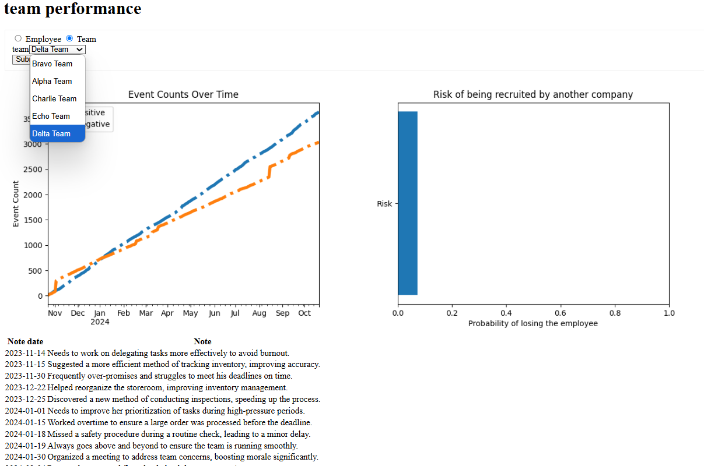

# Software Engineering for Data Scientists 
## Creating a Dashboard with FastHTML
This repository is my project for **Software Engineering for Data Scientists** , which is one of projects for **Udacity Data Scientists Nanodegree**. The project is built on an existing open-source codebase [dsnd-dashboard-project](https://github.com/udacity/dsnd-dashboard-project). 

### Project Overview
The project aims to create a dashboard that allows managers to monitor an employee's performance and their predicted risk of recruitment. This dashboard must fulfill the following business requirements:
- The dashboard visualizes the productivity of a single employee or a team of employees
- The dashboard displays an employee's likelihood of recruitment, or a team of employees' average likelihood of recruitment.

### Repository Structure
```
├── README.md
├── assets
│   ├── model.pkl
│   └── report.css
├── env
├── python-package
│   ├── employee_events
│   │   ├── __init__.py
│   │   ├── employee.py
│   │   ├── employee_events.db
│   │   ├── query_base.py
│   │   ├── sql_execution.py
│   │   └── team.py
│   ├── requirements.txt
│   ├── setup.py
├── report
│   ├── base_components
│   │   ├── __init__.py
│   │   ├── base_component.py
│   │   ├── data_table.py
│   │   ├── dropdown.py
│   │   ├── matplotlib_viz.py
│   │   └── radio.py
│   ├── combined_components
│   │   ├── __init__.py
│   │   ├── combined_component.py
│   │   └── form_group.py
│   ├── dashboard.py
│   └── utils.py
├── requirements.txt
├── start
├── tests
    └── test_employee_events.py
```

### employee_events.db



### Run the project locally
1. Install dependencies (pip install -r requirements.txt)
2. Run the app
(`uvicorn report.dashboard:app --reload`).

### Screenshots of running the project locally






